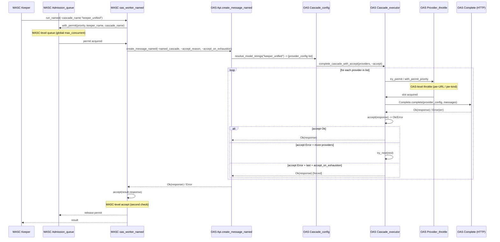
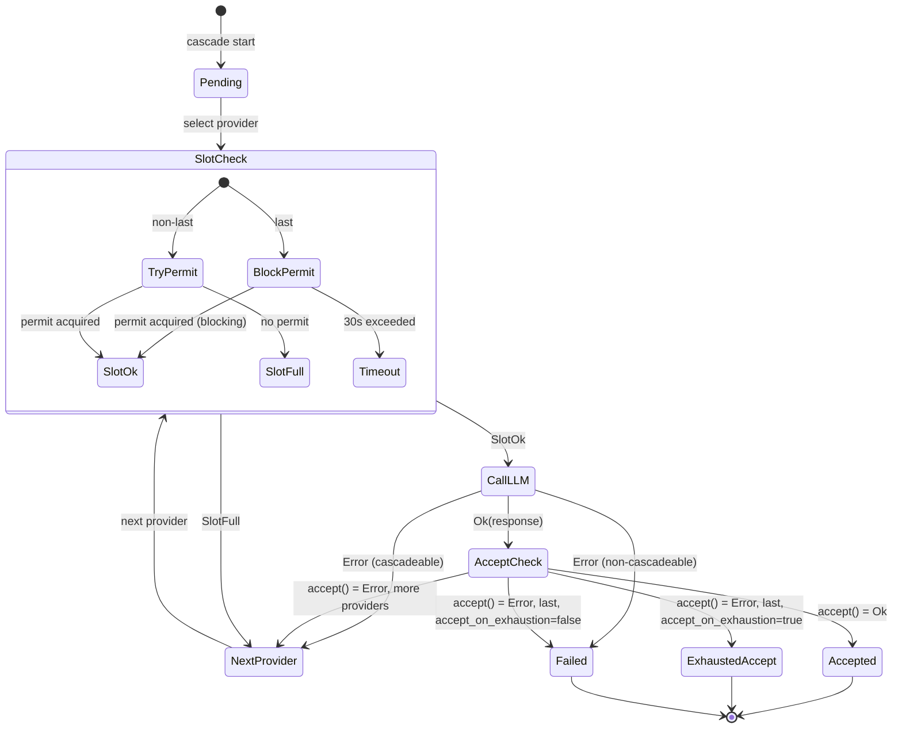

# Cascade Boundary Analysis — OAS vs MASC 경계 문제

> last-verified commit: `b26936b4` (2026-04-12)

## 1. 요약

cascade.json 기반 multi-provider failover가 OAS와 MASC 양쪽에 분산되어 있다.
OAS cascade_executor를 소비하는 제3자는 **0명** — MASC가 유일한 소비자.
이 문서는 현재 이중 레이어 구조의 증거를 고정하고, 왜 이것이 경계 오류인지 분석한다.

## 2. 현재 Call Chain



## 3. 이중 레이어 증거

### 3.1 이중 큐잉

| 레이어 | 파일 | 메커니즘 | 가시성 |
|--------|------|----------|--------|
| OAS Provider_throttle | `lib/llm_provider/cascade_executor.ml:42-96` | Eio.Mutex + Hashtbl, per-URL(local) per-kind(cloud) | OAS 내부, MASC에서 보이지 않음 |
| MASC Admission_queue | `masc-mcp/lib/admission_queue.ml` | Priority FIFO, global max_concurrent | MASC 내부, OAS에서 보이지 않음 |

두 큐는 서로의 존재를 모름. 결과:
- local LLM slot 3개 + MASC max_concurrent 3이면, 이론적 동시 요청 3이지만 OAS throttle에서 추가 대기 발생
- MASC Admission_queue의 priority와 OAS throttle의 priority가 별도 경로로 priority inversion 가능

### 3.2 이중 Accept

| 레이어 | 파일:라인 | 함수 시그니처 | 호출 시점 |
|--------|----------|-------------|----------|
| OAS | `cascade_executor.ml:334` | `~accept:(api_response -> (unit, string) result)` | cascade loop 내부, provider별 |
| MASC | `oas_worker_named.ml:275` | `accept result.response` (`bool`) | cascade 반환 후 |

OAS accept이 reject하면 다음 provider 시도.
MASC accept이 reject하면 전체 실패 (cascade 재시도 없음).
두 accept의 관계가 정의되어 있지 않음.

### 3.3 cascade.json 복제

```
oas/config/cascade.json (7 lines):
  default_models, briefing_models, coding_models, vision_models

masc-mcp/config/cascade.json (36 lines):
  default_models, local_only_models, keeper_unified_models,
  coding_first_models, + temperature/max_tokens overrides
```

MASC 버전이 더 풍부하고 실제 keeper가 사용하는 프로필을 포함.
동기화 메커니즘 없음.

### 3.4 제3자 소비자 = 0

```bash
rg "named_cascade|cascade_executor|complete_cascade" workspace/yousleepwhen/
```

결과: (a) OAS 내부 lib/test, (b) MASC, (c) 제3자 **없음**.

### 3.5 Context 직렬화 문제 (2026-04-12 실증)

keeper turn에서 175KB+ request body가 Ollama에 전송됨.
- `cascade_executor.truncate_to_context`는 **token 수** 기준으로만 잘라냄 (43K tokens < 57K budget)
- raw JSON 크기 (175KB)는 확인하지 않음
- keeper의 context_reducer에 실제 크기 감소 전략이 누락되어 있었음
- fix: `drop_thinking` + `stub_tool_results` + `prune_tool_outputs` 추가 (masc-mcp#6731)

이 사건은 cascade에 **ShrinkContext -> retry same provider** transition이 필요함을 실증.
현재 cascade는 "provider 교체"만 가능하고 "context 축소 -> 재시도"가 불가.

## 4. 왜 이것이 경계 오류인가

### Claude Agent SDK 비교

OAS는 `feedback_oas-follows-claude-agent-sdk.md`에 따라 Claude Agent SDK를 참조.
Claude Agent SDK:
- single provider per call (Anthropic API)
- retry: single provider 대상
- cross-provider failover: 없음
- slot queue: 없음

OAS에 cascade/throttle이 있는 것은 SDK 역할을 넘은 orchestration 침투.

### 올바른 경계

```
OAS (SDK): Provider.call(config, messages) -> Result<response, error>
           per-provider retry, request build, response parse

MASC (Orchestrator): cascade FSM 구동
                      state: Pending -> Trying(A) -> [call OAS] -> ShrinkContext -> [retry] -> Accepted
                      slot/admission 통합 queue
                      accept predicate 소유
                      cascade.json SSOT
                      context compaction 정책
```

## 5. 관찰적 FSM (cascade_executor의 현재 구조)



이 상태 머신은 코드에만 존재하고 명시적 `type state` 없음.
**누락된 transition**: `ShrinkContext -> retry same provider` (2026-04-12 실증).

## 6. 다음 단계

이 문서는 증거 고정. 실제 경계 이동은 별도 RFC:
- Phase 1: cascade FSM 순수 함수 추출 (OAS 내부)
- Phase 2: FSM + cascade.json + throttle을 MASC로 이동
- Phase 3: Agent.run mid-turn fallback 재설계

플랜 파일: `~/me/planning/claude-plans/polished-drifting-hamster.md`
